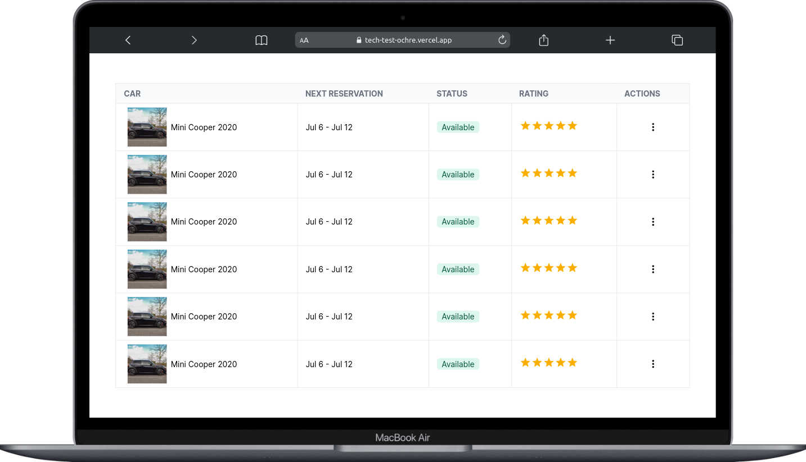
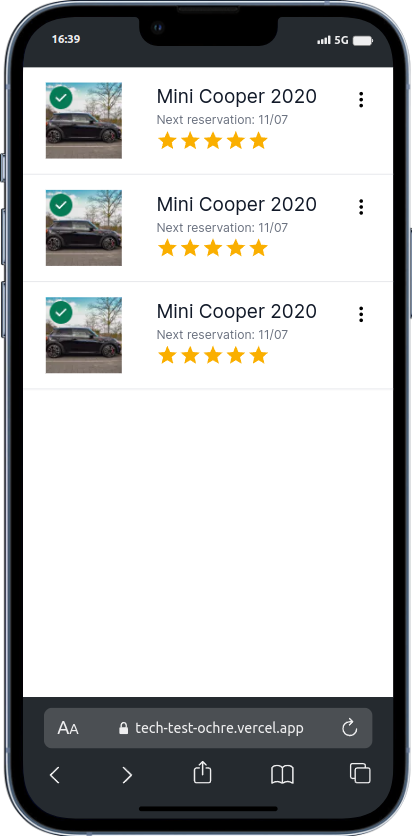

# Tech Test

### O que foi desenvolvido

Uma aplicação simples em Next.js que mostra uma tabela de carros com informações como disponibilidade, data para reserva e avaliações.



O projeto foi construído utilizando a versão 14.1 no Next.js e utilizando a biblioteca Tailwind CSS para a estilização. A aplicação é responsiva, mudando sua aparência de acordo com o dispositivo e também possui um design moderno.

O aplicação foi dividida em componentes para uma melhor leitura e organização do código.


<div align="center">

</div>


## Instalação

```python
git clone git@github.com:Wesleyhmendes/Tech-test.git

git cd tech-test

npm install

npm run dev
```

### Veja a aplicação rodando também [**aqui](https://tech-test-ochre.vercel.app/)!**
